**ΑΚΑΔΗΜΑΪΚΟ**** ****ΕΤΟΣ**** 2024-2025 **

**ΕΑΡΙΝΟ**** ****ΕΞΑΜΗΝΟ**

**ΜΑΘΗΜΑ****: ****Νεφοϋπολογιστική**

**Προπαρασκευαστικές οδηγίες για την εκτέλεση ****περιεκτών (****containers****)**** ****Docker**** ****τοπικά στον υπολογιστή σας**


Το μάθημα περιλαμβάνει ένα εργαστηριακό μέρος. Για τη διεξαγωγή του εργαστηριακού μέρους θα χρησιμοποιήσουμε Docker Containers (Περιέκτες Docker). Αυτός ο οδηγός αποτελείται από τα προπαρασκευαστικά βήματα που ζητείται να ολοκληρωθούν πριν από το πρώτο εργαστήριο. Αυτά τα βήματα περιλαμβάνουν τη ρύθμιση του Windows Subsystem For Linux (wsl) και του Docker Desktop σε έναν προσωπικό υπολογιστή. 

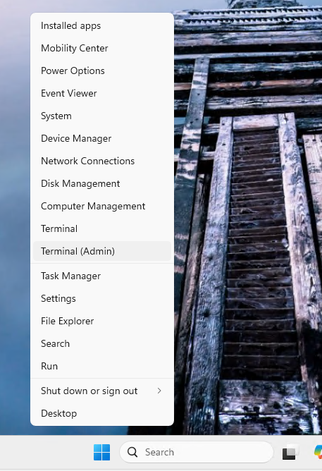


**Ενεργοποίηση**** WSL ****και**** Virtual Machine Platform**

Αρχικά, πρέπει να ενεργοποιήσετε το WSL και τη δυνατότητα Virtual Machine Platform στο Windows

**Ανοίξτε ένα PowerShell ως διαχειριστής:** Κάντε δεξί κλικ στο μενού "Έναρξη" και επιλέξτε **Windows Terminal (Administrator) ή PowerShell (Administrator)**.

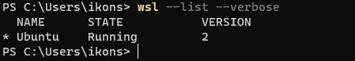

Εκτελέστε τις παρακάτω εντολές για να ενεργοποιήσετε το WSL και το Virtual Machine Platform. Μετά την εκτέλεση των εντολών κάντε επανεκκίνηση

```bash
wsl --install
Enable-WindowsOptionalFeature -Online -FeatureName Microsoft-Hyper-V -All
```

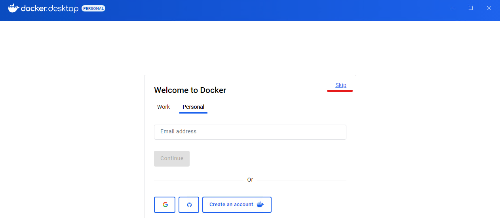


Ρύθμιση του Ubuntu

**Άνοιγμα του ****Ubuntu****:** Μετά την εγκατάσταση, κάντε κλικ στο μενού "Έναρξη" και αναζητήστε Ubuntu. Κάντε κλικ για να το ανοίξετε.

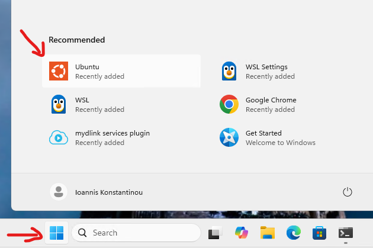

**Ρύθμιση χρήστη και κωδικού πρόσβασης:** Κατά την πρώτη εκκίνηση του Ubuntu, θα σας ζητηθεί να δημιουργήσετε έναν χρήστη και να ορίσετε έναν κωδικό πρόσβασης. Αυτός ο χρήστης θα είναι ο κύριος χρήστης για την εγκατάσταση του Ubuntu.


Αναβάθμιση και ενημερώσεις

Αφού το Ubuntu είναι έτοιμο, καλό είναι να εκτελέσετε μερικές εντολές για να βεβαιωθείτε ότι το σύστημά σας είναι ενημερωμένο:

**Αναβάθμιση των πακέτων**: Εκτελέστε την παρακάτω εντολή για να αναβαθμίσετε τα πακέτα του συστήματος:

```bash
sudo apt update && sudo apt upgrade -y
```

**1. Ελέγξτε την κατάσταση του WSL**
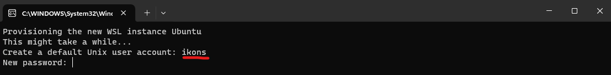


Ανοίξτε PowerShell (ως διαχειριστής) και εκτελέστε την εξής εντολή:

```bash
wsl --list --verbose
```


Αυτή η εντολή θα σας δείξει τις εγκατεστημένες διανομές του Linux και ποια είναι η προεπιλεγμένη. Αν το WSL έχει εγκατασταθεί σωστά, θα πρέπει να εμφανίζεται η διανομή Ubuntu (ή άλλη διανομή που έχετε εγκαταστήσει).

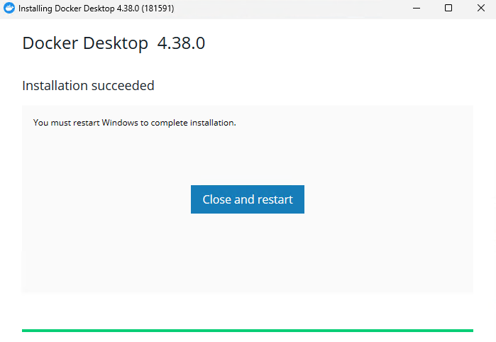

**Ελέγξτε αν το Virtual Machine Platform είναι ενεργοποιημένο**

Για να ελέγξετε αν το Virtual Machine Platform έχει ενεργοποιηθεί, εκτελέστε την παρακάτω εντολή:

Get-WindowsOptionalFeature -Online -FeatureName VirtualMachinePlatform

Αν το Virtual Machine Platform είναι ενεργοποιημένο, η κατάσταση του feature θα πρέπει να είναι **Enabled**.

**Ελέγξτε την τρέχουσα έκδοση του WSL**

Για να ελέγξετε ποια έκδοση του WSL (1 ή 2) χρησιμοποιείτε, εκτελέστε την παρακάτω εντολή:
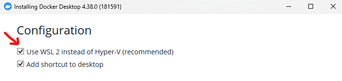


```bash
wsl --list --verbose
```

Θα δείτε την έκδοση του WSL για κάθε διανομή Linux (π.χ., 2 για WSL 2 ή 1 για WSL 1).

Αν όλα είναι σωστά ρυθμισμένα, το WSL και το Virtual Machine Platform θα πρέπει να εμφανίζονται ως ενεργοποιημένα και το Ubuntu ή άλλη διανομή θα είναι διαθέσιμη για χρήση στο σύστημά σας.

**Εγκατάσταση**** ****Docker**** ****Desktop****: **Μεταβείτε στην επίσημη σελίδα του Docker και κατέβασε την πιο πρόσφατη έκδοση του Docker Desktop για Windows x86_64: 

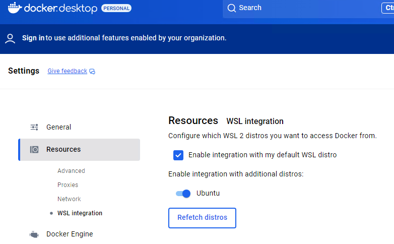


**Εκτέλεσε το αρχείο εγκατάστασης**: Κάνε διπλό κλικ στο αρχείο εγκατάστασης που κατέβασες και ακολούθησε τα βήματα του οδηγού εγκατάστασης.


**Επιλογές εγκατάστασης**:

Κατά τη διάρκεια της εγκατάστασης, βεβαιωθείτε ότι έχετε επιλέξει τη δυνατότητα **Use the WSL 2 based engine**.


Επίσης, το Docker Desktop θα εγκαταστήσει και το **Docker Desktop WSL 2 Backend**, που είναι απαραίτητο για να τρέξεις το Docker με το WSL 2.

**Ολοκλήρωση εγκατάστασης**: Όταν η εγκατάσταση ολοκληρωθεί, κάνε κλικ στο **Finish** και το Docker Desktop θα ξεκινήσει αυτόματα. Η εγκατάσταση θα διαρκέσει λίγη ώρα. Θα χρειαστεί να επανεκκινήσετε τον υπολογιστή σας.


Μετά την επανεκκίνηση θα σας ζητηθεί να δημιουργήσετε λογαριασμό στην υπηρεσία. Δεν είναι υποχρεωτικό, και μπορείτε να επιλέξετε skip


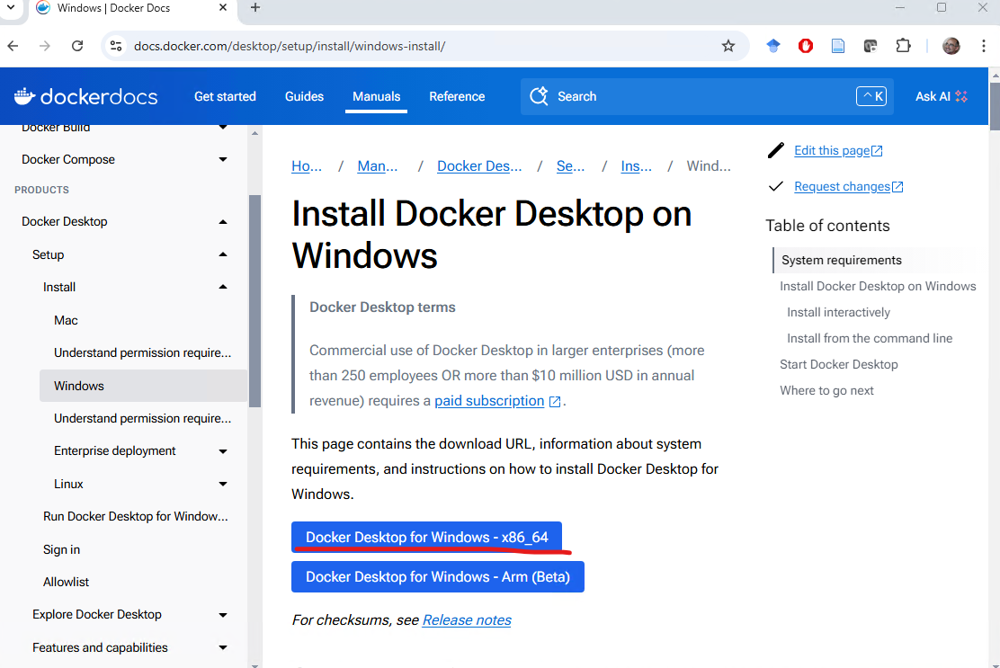

**Ρύθμιση Docker για χρήση με WSL 2**** :** Μετά την εγκατάσταση, μπορείς να ανοίξεις το **Docker Desktop** μέσω του **Μενού Έναρξη**.

Αν είναι η πρώτη φορά που ανοίγεις το Docker Desktop, θα σε καθοδηγήσει να ενεργοποιήσεις το WSL 2.

Σιγουρέψου ότι το **WSL 2** είναι επιλεγμένο ως backend στο Docker Desktop. Για να το ελέγξεις, πήγαινε στο **Settings** (Ρυθμίσεις) του Docker και, στη συνέχεια, στην καρτέλα **General**, έλεγξε ότι η επιλογή **Use the WSL 2 based engine** είναι ενεργοποιημένη.


**Επιλογή διανομής WSL για Docker**: Στην καρτέλα **Resources** του Docker Desktop, μπορείς να δεις ποιες διανομές Linux του WSL είναι διαθέσιμες για χρήση με το Docker. Βεβαιώσου ότι έχεις επιλέξει την διανομή Ubuntu (ή άλλη που έχεις εγκαταστήσει) για χρήση με το Docker.


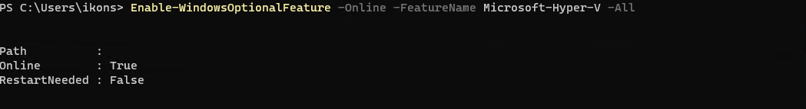


**Επανεκκίνηση του Docker**: Αν κάνεις αλλαγές στις ρυθμίσεις, πρέπει να επανεκκινήσεις το Docker Desktop για να εφαρμόσουν οι αλλαγές.

**Επιβεβαίωση Εγκατάστασης**

Άνοιξε το **ubuntu**** ****terminal** και εκτέλεσε την εντολή για να επιβεβαιώσεις ότι το Docker δουλεύει σωστά:

```bash
docker --version
```

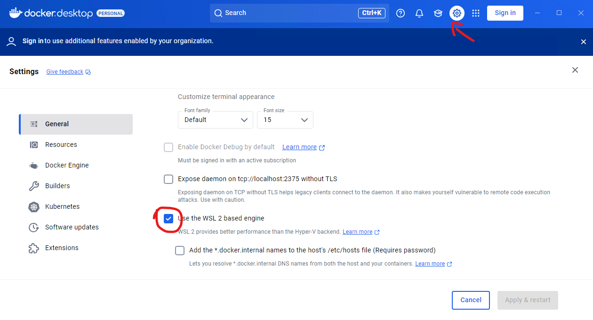

Αυτό θα πρέπει να εμφανίσει την έκδοση του Docker που έχεις εγκαταστήσει.


Δοκίμασε να εκτελέσεις την εντολή:

```bash
docker run hello-world
```

Αυτή η εντολή θα κατεβάσει και θα εκτελέσει μια απλή εικόνα Docker που εκτυπώνει ένα μήνυμα επιτυχίας αν το Docker είναι σωστά εγκατεστημένο και λειτουργεί.
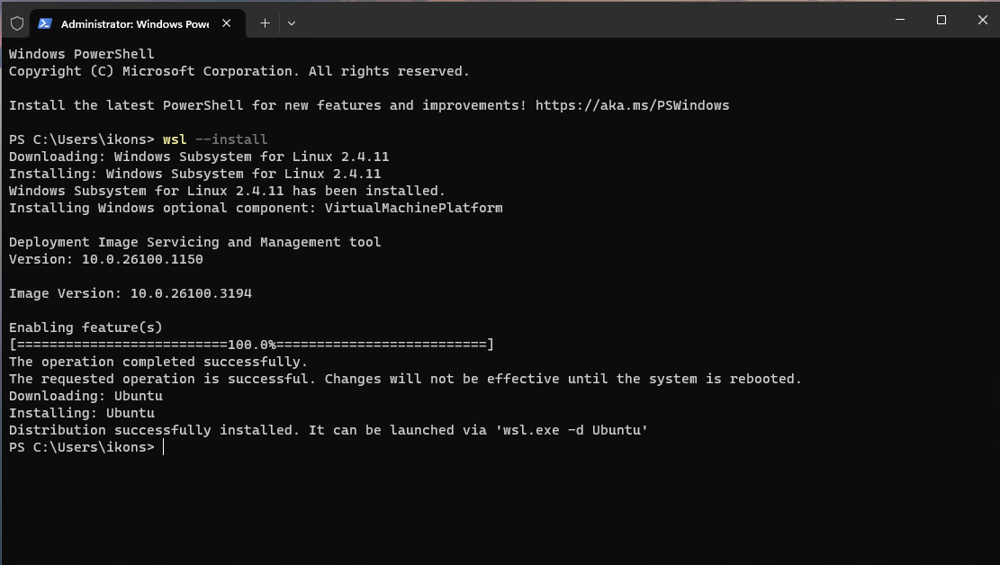


**Ενημερώσεις και Ρυθμίσεις**

**Αναβάθμιση Docker**: Το Docker Desktop ενημερώνεται αυτόματα. Μπορείς να ελέγξεις αν υπάρχουν νέες εκδόσεις στις **Settings** > **Updates**.

**Ρυθμίσεις πόρων**: Στην καρτέλα **Resources** του Docker Desktop, μπορείς να ρυθμίσεις τη χρήση πόρων όπως CPU, μνήμη (RAM) και δίσκο για το WSL backend.


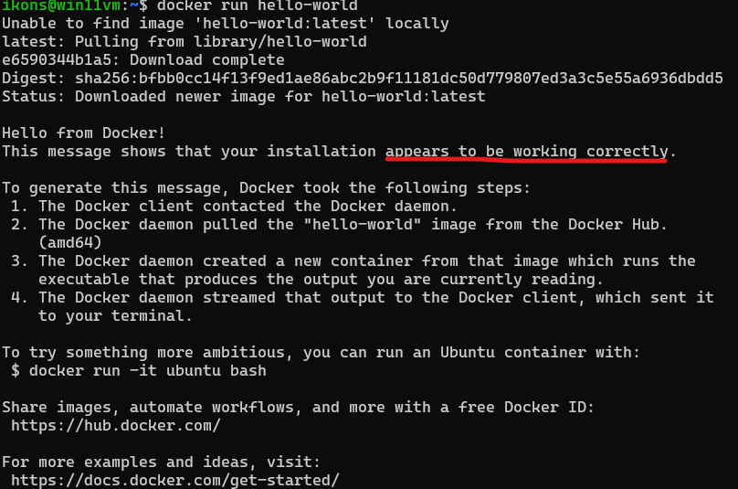

